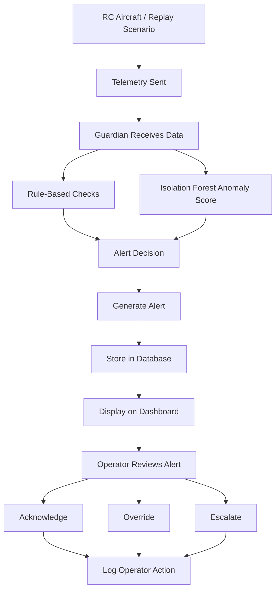

# Human-in-the-Loop AI Guardian for Connected Aerospace Systems stage 1 Report

## 1. Introduction

This report presents the first stage of our end-of-year project: team formation, idea exploration, project selection, and initial refinement of the **MVP (Minimum Viable Product)**. The purpose of this stage was to build a clear team structure, explore different project directions, evaluate them, and select one realistic and meaningful concept to develop further.

Our final choice is a project called **Human-in-the-Loop AI Guardian for Connected Aerospace Systems**. The goal of this project is to monitor telemetry data from an RC aircraft testbed, detect suspicious anomalies or inconsistencies, and support safer decision-making through structured alerts and human supervision.

The system combines:
- an **RC aircraft telemetry source**
- a **Python-based Guardian module**
- **rule-based anomaly detection**
- a lightweight **unsupervised anomaly score** using Isolation Forest
- a **database and dashboard layer**
- a **human-in-the-loop alert workflow**

## 2. Team Formation

At this stage, the team is composed of two members. Since the team is small, each person covers a large part of the project, and responsibilities were assigned according to current strengths and project needs.

Team Members and Roles

Kedia Ihogoza
- Project lead
- Aircraft/testbed development
- Telemetry design
- Embedded systems work
- Rule-based anomaly detection
- Machine learning integration
- Overall system coordination

Davi Roset

- Database development
- Dashboard development
- Data storage structure
- Backend/frontend integration support

# Role Definition Rationale

These roles were assigned based on the technical direction of the project and each member’s strongest area of contribution.

Kedia has already been developing the RC aircraft and is leading the technical architecture of the project. For that reason, it is logical for Kedia to manage the aircraft side, telemetry structure, anomaly detection, and AI-related work.

Davi Roset is responsible for the dashboard and database side, which is essential for organizing, storing, and visualizing telemetry and alert data in a clear way.

# Collaboration Tools and Team Norms

The team uses the following tools:

- Discord for communication and quick updates
- GitHub for version control and code collaboration
- Shared written notes/documents for technical decisions and project organization

The team also established the following norms:

- communicate regularly on progress and blockers
- document important decisions
- keep responsibilities clear
- keep the MVP realistic and focused
- review architecture and priorities together when needed

## 3. Research and Brainstorming

Before selecting the final project idea, we explored several possible directions related to digital monitoring, telemetry, data integrity, and aerospace-inspired systems.

The goal of brainstorming was not only to generate ideas, but also to compare them based on feasibility, innovation, and relevance to our skills.

# Brainstormed Ideas

- Idea 1 — Aerospace Maintenance Dashboard:
 A web dashboard to display aircraft maintenance data, operational status, and alerts.

- Reason for rejection:
 This idea was useful but too generic. It focused more on displaying information than on solving a deeper anomaly-detection or decision-support problem.

- Idea 2 — Fleet Tracking / Monitoring Platform:
 A platform to track the state and location of aircraft or RC vehicles through a web interface.

- Reason for rejection:
 This was feasible, but it did not go far enough in terms of data validation, anomaly detection, or human-centered safety support.

- Idea 3 — Battery and Communication Failure Monitor:
A monitoring system focused only on battery health and communication-link failures.

- Reason for rejection:
This idea was realistic, but too limited in scope. It could be included as one part of a bigger system, but on its own it did not provide enough impact for a final project.

- Idea 4 — Human-in-the-Loop AI Guardian for Connected Aerospace Systems:
A telemetry-monitoring and anomaly-detection system that checks aircraft-related data, detects suspicious inconsistencies, and provides structured alerts with recommended safe actions while keeping the human operator involved.

- Reason for selection:
 This idea best matched our goals, our skills, and the work already started on the RC aircraft. It also offered a stronger balance between technical depth, relevance, and feasibility.

---

## 4. Idea Evaluation

To compare the brainstormed ideas, we used the following criteria:

- Feasibility: can the project be built as an MVP with our current time and resources?
- Innovation: does it go beyond a simple interface or basic monitoring?
- Impact: does it solve a meaningful and realistic problem?
- Technical alignment: does it match the team’s current skills and learning goals?
- Scalability: can the project be expanded later if needed?

# Ranking of Ideas

1. Human-in-the-Loop AI Guardian for Connected Aerospace Systems
2. Fleet Tracking / Monitoring Platform
3. Aerospace Maintenance Dashboard
4. Battery and Communication Failure Monitor

The selected idea ranked first because it was the most complete in terms of technical interest, existing progress, and future value.

---

## 5. Selected MVP Concept

- MVP Summary

The selected MVP is a monitoring and alerting system called **Guardian**. It is designed to receive telemetry from an RC aircraft testbed, analyze the data, detect suspicious anomalies, and provide structured alerts to help a human operator understand what is happening and what action should be considered.

The Guardian focuses on **human-in-the-loop monitoring** rather than full automation. This means the system supports decision-making, but does not replace human responsibility in critical situations.

## MVP Feature Overview

| Feature | Notes | Feasibility | Risks | Priority |
|---|---|---|---|---|
| Telemetry ingestion | Receive and process telemetry from the RC aircraft testbed or replayed scenario files. | High | Hardware delays or inconsistent data format. | High |
| Rule-based anomaly detection | Detect known issues such as packet loss, sensor dropout, GPS jumps, low battery, and GPS/IMU inconsistency. | High | Thresholds may need tuning to reduce false alerts. | High |
| Unsupervised anomaly scoring | Use Isolation Forest to compute a supporting anomaly score from telemetry patterns. | Medium | Small dataset may limit performance and anomaly separation. | Medium |
| Human-in-the-loop alerting | Generate alerts with severity, reason code, confidence, and recommended action for operator review. | High | Alerts may become too frequent if not well calibrated. | High |
| Web dashboard | Display telemetry, alert history, and system state in a browser interface. | Medium | Integration may take time if backend contracts are not fixed early. | High |
| Database storage | Store telemetry, alerts, and operator actions for traceability and replay. | High | Schema changes during development may require refactoring. | Medium |
| Replay mode | Replay CSV scenarios to test the Guardian before full aircraft readiness. | High | Test scenarios may be simpler than real flight data. | High |
| RC aircraft testbed integration | Connect real onboard telemetry from the aircraft to the Guardian system. | Medium | Aircraft readiness, sensor integration, and communication reliability may delay testing. | High |

---

## 6. Problem Statement

Connected systems depend on continuous data exchange between sensors, onboard electronics, and ground-side tools. This creates efficiency and visibility, but also introduces risks. If telemetry becomes delayed, inconsistent, corrupted, or misleading, the system or operator may make incorrect decisions.

In our case, examples of such problems include:

- packet loss
- delayed data
- sensor dropout
- suspicious GPS jumps
- GPS/IMU inconsistency
- low-battery instability

The project therefore addresses the need for a system that can:

- monitor data integrity
- detect suspicious situations
- explain alerts clearly
- recommend safer actions

## 7. Proposed Solution

The proposed MVP combines:
- an RC aircraft telemetry testbed
- a Python-based Guardian module
- a database layer
- a web dashboard

The Guardian receives telemetry fields such as:

- timing and packet data
- motion/IMU data
- GPS/navigation data
- altitude/environment data
- battery and link status

It then analyzes this information using:

- rule-based checks for known conditions
- a lightweight unsupervised anomaly score for unusual telemetry behavior

When something suspicious is detected, the system produces alerts that include:

- severity
- reason code
- confidence score
- recommended action

These outputs are intended to be displayed in a dashboard so that the operator can understand the issue and react appropriately.

## 8. Target Users

The project is mainly intended for:
- operators monitoring telemetry
- engineers or testers working with connected aerospace systems
- students or researchers experimenting with embedded monitoring and anomaly detection

Although the prototype is based on an RC aircraft, the concept is meant to reflect a broader connected aerospace monitoring problem.

## 9. Type of Application

This MVP is mainly a web-based monitoring application, supported by:
- an embedded telemetry source (RC aircraft + sensors)
- a Python anomaly-detection module
- a database/storage layer

So the project combines both:

- hardware / embedded systems
- software / monitoring and decision support

## 10. Reasons for Selection

We selected this idea because:

1. It builds directly on an existing RC aircraft project already in progress.
2. It matches our technical strengths in embedded systems, Python, databases, and interface development.
3. It is realistic to prototype because software work can begin with replayed data before full aircraft testing.
4. It solves a more meaningful problem than a simple dashboard by focusing on anomaly detection and data integrity.
5. It has room for improvement and extension in later stages.

## 11. Key Features and Objectives

# Main Features

1. Telemetry monitoring pipeline
 Receive telemetry from the aircraft or replayed test scenarios.
2. Anomaly detection module
 Detect packet loss, sensor dropout, low battery, GPS jumps, and GPS/IMU inconsistency.
3. Structured alerting
 Generate alerts that include severity, confidence, reason code, and recommended action.

## MVP Objectives

- Build a working telemetry-monitoring pipeline using replayed and later real aircraft data.
- Detect at least four defined anomaly scenarios in the Guardian module.
- Provide outputs that can be visualized in a dashboard for demonstration and interpretation.

## 12. Scope

In Scope

• RC aircraft telemetry testbed
• replayed scenario testing
• rule-based anomaly detection
• supporting unsupervised anomaly score
• structured alert outputs
• database support
• basic dashboard integration

Out of Scope

• full autonomous flight control
• industrial-scale deployment
• advanced certified avionics
• large supervised ML classification system
• complete cybersecurity infrastructure

Keeping these limits is important to maintain a realistic MVP.

## User Journey MVP

The following diagram shows the basic MVP journey from telemetry generation to operator action.

### Simple explanation
1. Telemetry comes from the aircraft or replayed scenario files.
2. The Guardian receives and analyzes the data.
3. Rule-based checks and the anomaly score are applied.
4. If suspicious behavior is detected, an alert is generated.
5. The alert is stored and displayed on the dashboard.
6. The operator reviews the alert and can acknowledge, override, or escalate it.
7. The operator action is logged for traceability.

## Risks and Mitigation

| Risk | Description | Mitigation |
|---|---|---|
| Limited ML experience | The ML part may be difficult to tune at first. | Start with rule-based detection and keep ML lightweight and supportive. |
| Hardware delays | Aircraft or sensor integration may take more time than expected. | Continue development with replayed CSV scenarios in parallel. |
| Small team size | A 2-person team has limited capacity. | Keep the MVP focused and clearly divide responsibilities. |
| Scope expansion | The project may become too broad. | Limit the MVP to telemetry anomaly detection and alerting. |
| False alerts | Detection thresholds may be too sensitive or not sensitive enough. | Test multiple scenarios and adjust thresholds progressively. |

# Current Progress

Completed

- project structure set up on GitHub
- telemetry schema defined
- replay-based Guardian testing implemented
- rule-based anomaly detection implemented
- validation scenarios created
- Isolation Forest integrated as a supporting anomaly score

In Progress

- RC aircraft telemetry development
- dashboard and database implementation
- alert visualization workflow
- live integration between components

Planned

- full dashboard integration
- database-backed traceability
- live telemetry ingestion from aircraft
- expanded anomaly scenarios
- improved user interaction flow

Roadmap

Stage 1

- team formation
- idea selection
- MVP definition
- documentation

Stage 2

- telemetry replay system
- Guardian logic
- anomaly scenarios
- first validation tests

Stage 3

- dashboard and database integration
- alert display and traceability
- operator interaction workflow

Stage 4
- aircraft integration
- real telemetry tests
- final evaluation and presentation

Why This Project Matters

This project is not only about detecting anomalies.
It is also about designing a system that supports trustworthy monitoring, clear alerts, and human-centered decision-making in connected aerospace environments.

It brings together:

- embedded systems
- telemetry
- anomaly detection
- data integrity
- interface design
- traceability
- human-in-the-loop system thinking

🧩 Status

~ Ongoing project

This project is actively being developed as an end-of-year school project.
