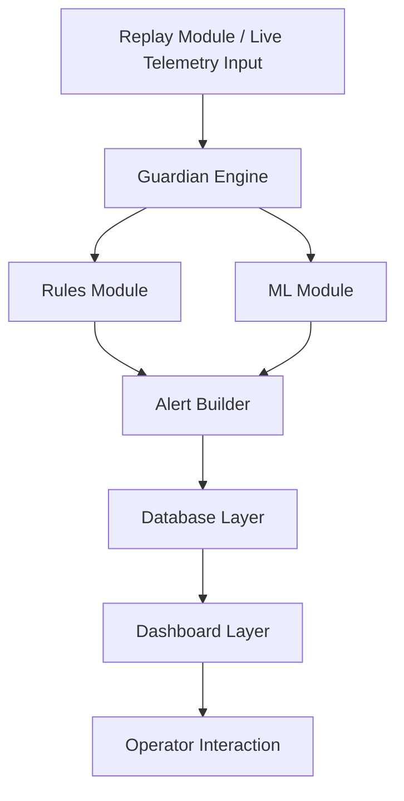
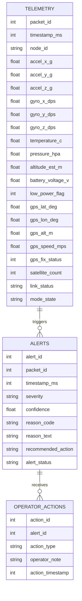
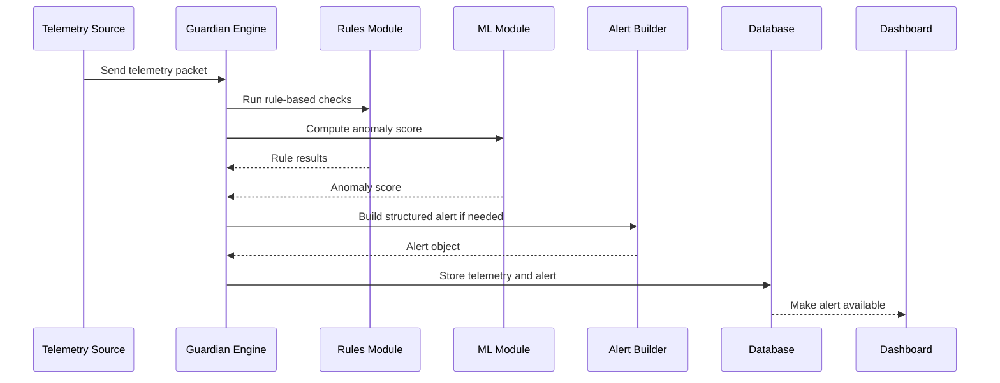
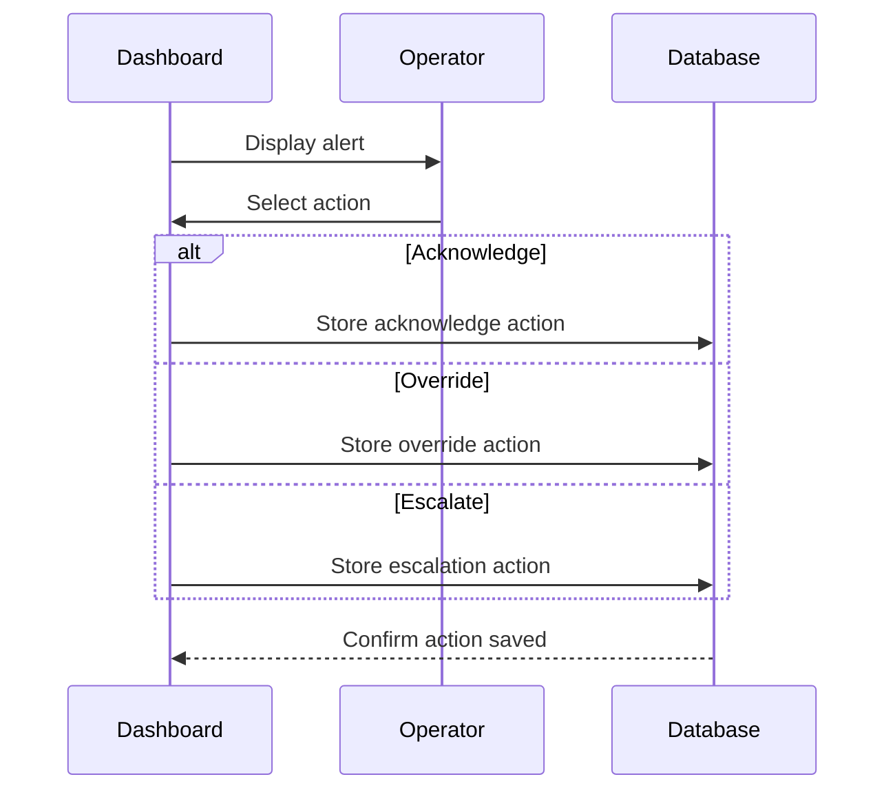

# Stage 3 Report – Technical Documentation

## Project Title
**Human-in-the-Loop AI Guardian for Connected Aerospace Systems**

## 1. Introduction

This document presents the technical documentation for the **Human-in-the-Loop AI Guardian for Connected Aerospace Systems**. The purpose of this stage is to translate the project objectives and requirements into a clear technical plan for implementation.

This documentation defines:
- the main user stories
- the system architecture
- the major components and modules
- the database structure
- key sequence diagrams
- the internal and external APIs
- the source control and quality assurance strategies
- the technical justifications behind the chosen design

The objective is to create a complete blueprint that will guide the development of the MVP and keep the team aligned on the technical direction of the project.

## 2. User Stories

### 2.1 Must Have
- As an operator, I want to view incoming telemetry, so that I can monitor the aircraft state.
- As an operator, I want to receive alerts when suspicious anomalies are detected, so that I can react quickly.
- As an operator, I want to see the reason code, confidence score, and recommended action, so that I can understand the alert clearly.
- As a developer, I want replayed telemetry scenarios, so that I can validate the Guardian before full aircraft integration.
- As a system, I want to store telemetry and alerts, so that events remain traceable.

### 2.2 Should Have
- As an operator, I want to acknowledge, override, or escalate alerts, so that human decisions remain part of the workflow.
- As a developer, I want to compute an unsupervised anomaly score, so that unusual telemetry patterns can also be analyzed.

### 2.3 Could Have
- As an operator, I want to review alert history, so that I can understand previous incidents.
- As a developer, I want to integrate real aircraft telemetry, so that the system can move beyond replay-based validation.

### 2.4 Won’t Have (for this MVP)
- Full autonomous flight control
- Advanced supervised machine learning classification
- Production-scale aerospace deployment
- Certified avionics integration

## 3. Mockups

Since this MVP includes a dashboard interface, the main screens to be represented are:

### 3.1 Dashboard Mockup

The dashboard will display:
- live or replayed telemetry
- current system state
- active alerts
- alert history
- operator actions

### 3.2 Alert View Mockup

The alert view will show:
- severity
- reason code
- confidence score
- recommended action
- action buttons such as acknowledge, override, or escalate

**Note:** At this stage, simple wireframes are sufficient. Detailed UI design is not the main focus of the MVP.

## 4. System Architecture

### 4.1 High-Level Architecture Diagram

```mermaid
flowchart LR
    A[RC Aircraft / Sensors] --> B[Telemetry Sender]
    B --> C[Ground Receiver]
    C --> D[Guardian Engine]
    D --> E[Rule-Based Checks]
    D --> F[Isolation Forest]
    E --> G[Alert Builder]
    F --> G
    G --> H[(Database)]
    H --> I[Web Dashboard]
    I --> J[Operator]
 ```

### 4.2 Data Flow Explanation

The system begins with telemetry generated either by the RC aircraft testbed or by replayed validation scenarios. This data is sent to the ground-side system, where the Guardian Engine processes it.

The Guardian applies:
- rule-based anomaly detection
- a lightweight unsupervised anomaly score

If suspicious behavior is detected, the Alert Builder creates a structured alert. Alerts and telemetry are stored in the database and displayed in the dashboard, where the operator can review and respond to them.

### 4.3 User Journey / Functional Flow Diagram

```mermaid
flowchart TD
    A[Telemetry Received] --> B[Guardian Analyzes Data]
    B --> C{Anomaly Detected?}
    C -- No --> D[Continue Monitoring]
    C -- Yes --> E[Generate Alert]
    E --> F[Store Alert]
    F --> G[Display Alert on Dashboard]
    G --> H[Operator Reviews Alert]
    H --> I[Acknowledge]
    H --> J[Override]
    H --> K[Escalate]
    I --> L[Log Operator Action]
    J --> L
    K --> L
```

## 5. Components and Modules

### 5.1 Main Components

The main components of the MVP are:

- **Telemetry Source**  
  Provides telemetry from replayed CSV scenarios or later from the RC aircraft.

- **Guardian Engine**  
  Central logic layer that processes telemetry and coordinates detection modules.

- **Rules Module**  
  Detects known conditions such as packet loss, sensor dropout, low battery, GPS jump, and GPS/IMU inconsistency.

- **ML Module**  
  Computes a supporting anomaly score using Isolation Forest.

- **Alert Builder**  
  Converts anomaly results into structured alerts.

- **Database Layer**  
  Stores telemetry, alerts, and operator actions.

- **Dashboard Layer**  
  Displays telemetry, alerts, and system state to the operator.

### 5.2 Component Diagram

| Component | Role |
|---|---|
| **Telemetry Source** | Provides telemetry from replayed scenarios or the RC aircraft. |
| **Guardian Engine** | Processes telemetry and coordinates detection modules. |
| **Rules Module** | Detects known anomalies using rule-based checks. |
| **ML Module** | Computes a supporting anomaly score. |
| **Alert Builder** | Converts anomaly results into structured alerts. |
| **Database Layer** | Stores telemetry, alerts, and operator actions. |
| **Dashboard Layer** | Displays telemetry, alerts, and system state. |

### 5.2 Component Diagram



### 5.3 Module / Class Design

The Python project is organized around the following core files:

| Module / File | Responsibility |
|---|---|
| `main.py` | Entry point used to run the Guardian on selected scenarios |
| `replay.py` | Reads CSV telemetry row by row for replay testing |
| `engine.py` | Coordinates rules and ML scoring |
| `rules.py` | Contains rule-based anomaly detection functions |
| `alerts.py` | Builds structured alert objects |
| `ml_model.py` | Implements Isolation Forest anomaly scoring |
| `schemas.py` | Defines expected telemetry fields and data structure |
| `utils.py` | Stores helper functions for general use |

## 6. Database Design

### 6.1 Database Overview

The system uses a relational structure to keep telemetry, alerts, and operator actions organized and traceable.

The three main logical entities are:
- **telemetry**
- **alerts**
- **operator actions**

### 6.2 ER Diagram



### 6.3 Table Descriptions

| Table | Purpose |
|---|---|
| `telemetry` | Stores incoming telemetry packets from replayed scenarios or later from live aircraft data. |
| `alerts` | Stores structured alerts generated by the Guardian. |
| `operator_actions` | Stores operator responses such as acknowledge, override, or escalate. |

## 7. Sequence Diagrams

### 7.1 Telemetry to Alert



### 7.2 Operator Response



#### Explanation

This sequence diagram shows how the operator interacts with the system after an alert is displayed. The operator can acknowledge, override, or escalate the alert, and the selected action is then stored in the database for traceability.

## 8. API Specifications

### 8.1 External APIs

At this stage, the MVP does not depend on mandatory external APIs.

The main telemetry source is:
- replayed CSV data
- and later real telemetry from the RC aircraft testbed

Possible future external services may include:
- map visualization services
- telemetry communication frameworks
- flight-control or robotics communication standards

### 8.2 Internal API Endpoints

The following internal endpoints are planned for the MVP backend:

| Endpoint | Method | Input | Output | Purpose |
|---|---|---|---|---|
| `/telemetry` | `POST` | JSON telemetry packet | Success / error JSON | Receive telemetry data |
| `/alerts` | `GET` | Optional query parameters | JSON list of alerts | Retrieve alerts |
| `/alerts/active` | `GET` | None | JSON list of active alerts | View current active alerts |
| `/telemetry/history` | `GET` | Optional query parameters | JSON telemetry history | Retrieve stored telemetry |
| `/actions` | `POST` | JSON action payload | Success / error JSON | Save operator actions |

#### Example Input Format for `/telemetry`

```json
{
  "timestamp_ms": 1200,
  "packet_id": 3,
  "node_id": "aircraft_1",
  "accel_x_g": 0.01,
  "accel_y_g": 0.00,
  "accel_z_g": 1.01,
  "gyro_x_dps": 0.5,
  "gyro_y_dps": 1.3,
  "gyro_z_dps": 0.2,
  "battery_voltage_v": 11.8,
  "gps_lat_deg": 43.609900,
  "gps_lon_deg": 1.450000,
  "gps_speed_mps": 48.0,
  "mode_state": "WARNING"
}
```

#### Explanation

This example shows the JSON structure expected by the `/telemetry` endpoint. It contains timing, motion, power, and navigation data used by the Guardian to analyze the aircraft state and detect anomalies.

#### Example Output Format for `/alerts`

```json
{
  "timestamp_ms": 1200,
  "packet_id": 3,
  "node_id": "aircraft_1",
  "severity": "CRITICAL",
  "confidence": 0.96,
  "reason_code": "GPS_IMU_INCONSISTENCY",
  "reason_text": "GPS changed significantly without matching IMU motion.",
  "recommended_action": "VERIFY_OPERATOR_AND_ENTER_DEGRADED_MODE",
  "alert_status": "NEW"
}
```

#### Explanation

This example shows the JSON structure returned for an alert generated by the Guardian. It includes the alert severity, confidence score, reason code, human-readable reason text, recommended action, and current alert status.

## 9. SCM Strategy

The project uses **GitHub** for source control management.

### 9.1 Branching Strategy

- `main` branch for stable project state
- feature branches for specific tasks or modules
- merge only after review and validation

### 9.2 SCM Practices

- regular commits with clear messages
- logical feature separation
- push progress frequently
- maintain documentation in parallel with development
- use pull requests and reviews when changes become larger

### 9.3 Why This Strategy Is Important

This strategy helps to:
- reduce confusion
- preserve project history
- support collaboration between both team members

## 10. QA Strategy

The quality assurance strategy combines:
- replay-based validation
- rule verification
- output inspection
- progressive integration testing

### 10.1 QA Methods

- Scenario testing using CSV replay files
- Functional verification to check whether alerts match expected anomalies
- Manual review of alert outputs, reason codes, and recommended actions
- Progressive integration testing when connecting dashboard, database, and telemetry inputs

### 10.2 Test Scenarios

- normal flight
- packet loss
- sensor dropout
- low battery
- GPS jump
- GPS/IMU inconsistency

### 10.3 QA Goal

The goal is to confirm that the Guardian:
- behaves correctly on normal data
- detects defined anomalies
- produces understandable outputs
- remains traceable and testable

## 11. Technical Justifications

### 11.1 Python

Python was chosen because it is well suited for:
- telemetry processing
- anomaly detection logic
- machine learning integration
- fast prototyping

### 11.2 Rule-Based Checks

Rule-based detection was chosen as the primary detection layer because it is:
- easy to explain
- easy to test
- reliable for known anomaly cases

### 11.3 Isolation Forest

Isolation Forest was selected as a lightweight unsupervised method because:
- it does not require large labeled datasets
- it fits anomaly detection use cases
- it can complement rules without replacing them

### 11.4 Replay-First Development

Replay-based testing was chosen because:
- aircraft readiness may take time
- software work can continue before live integration
- scenarios can be validated repeatedly and consistently

### 11.5 Database and Dashboard

A database and dashboard are necessary because:
- alerts must be traceable
- telemetry must be reviewable
- operators need a clear interface for decision support

### 11.6 Human-in-the-Loop Design

Human supervision is essential because:
- anomaly detection can support but should not fully replace human judgment
- critical alerts need interpretation
- the project aims to balance automation with operator control

## 12. Conclusion

This technical documentation provides the blueprint for building the MVP. It defines the functional expectations, technical architecture, internal components, data structure, interaction flows, API direction, and development strategy.

By establishing these technical foundations before implementation, the project becomes easier to build, test, explain, and improve. This stage also ensures that both team members remain aligned on the same technical vision as development continues.
